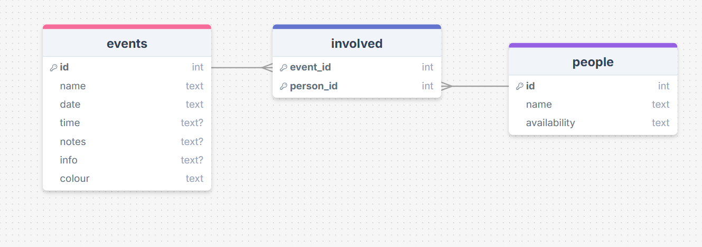

# Sprint 1 - A Working UI Prototype

## Sprint Goals

Develop a prototype that simulates the key functionality of the system, then test and refine it so that it can serve as the model for the next phase of development in Sprint 2.

[Figma](https://www.figma.com/) is used to develop the prototype.

---

## Initial Database Design

First thing I did was make a simple database that contained only the very basics of what I would need, a table for the events(Including name, date, time, and a list of the people involved.), a table for people(Including their name and a list of the events they're in.), and a table connecting the two so that people can be assigned to events and vice versa.

After consultation with my end user, I quickly added columns for notes and info to the events table, and an availability column for the people table.

---

## Initial UI Design

Then I started on my first UI design, it has six pages, the first is a list of all the events, with columns showing date, time, the name, and the people, next page was simply a list of the people, then there are two info pages, one for people, and one for events, and two more pages that are both forms for adding new people and events.

<iframe style="border: 1px solid rgba(0, 0, 0, 0.1);" width="800" height="450" src="https://embed.figma.com/proto/LSzl7IDHJySNSuXooOp4vJ/Untitled?node-id=1-9&scaling=min-zoom&content-scaling=fixed&page-id=0%3A1&starting-point-node-id=1%3A9&embed-host=share" allowfullscreen></iframe>

### Testing

After testing all the links I realized that all of the return buttons took you all the way back to the first page, which wasn't always what you wanted.

### Feedback

I showed this version to my end user and was told that they wanted an option to view the upcoming events in a calendar format.

## Second UI Design

In this version I added the aforementioned calendar format, as well as adding buttons to give you more control over where to go.

<iframe style="border: 1px solid rgba(0, 0, 0, 0.1);" width="800" height="450" src="https://embed.figma.com/proto/jFS1CjPabqmKelJAqZXoEC/Untitled--Copy-?scaling=min-zoom&content-scaling=fixed&page-id=0%3A1&node-id=1-9&starting-point-node-id=1%3A9&embed-host=share" allowfullscreen></iframe>

## Colours

I prepared three options for my end user to pick from, and while doing this they also said they wanted the ability to colour-code events.

## Second Database Design

After this I added another table for colours so that the end user could add more as they wanted. 

 eventually though, I decided against this as it was over complicating my database, so I simply made colour into a single column, I also removed some other columns that I didn't need, and cleaned up the tables as a whole.

## Final UI Design

Not much changed functionality-wise from the second to final designs, but I implemented the chosen colour palette and removed un-needed buttons to give it a less cluttered look.

<iframe style="border: 1px solid rgba(0, 0, 0, 0.1);" width="800" height="450" src="https://embed.figma.com/proto/2b1RF5UQ7M2zAOFe4P5bbW/titled?scaling=min-zoom&content-scaling=fixed&page-id=0%3A1&node-id=3-3&starting-point-node-id=3%3A3&embed-host=share" allowfullscreen></iframe>

## Sprint Review

During this sprint I managed to take my idea from a concept to a really solid design that manages to be functional and aesthetically pleasing, and although I had a bit of trouble figuring out my database, I believe I'm happy with my final version. 

Replace this text with a statement about how the sprint has moved the project forward - key success point, any things that didn't go so well, etc.

