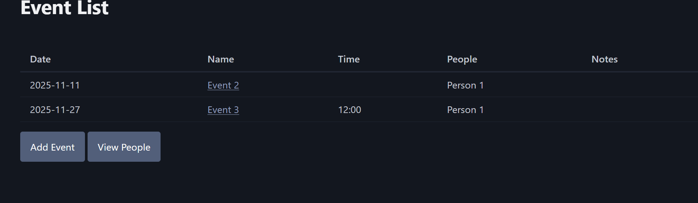

# Sprint 2 - A Minimum Viable Product (MVP)

## Sprint Goals

Develop a bare-bones, working web application that provides the key functionality of the system, then test and refine it so that it can serve as the basis for the final phase of development in Sprint 3.

---

## Implemented Database Schema

Replace this text with notes regarding the DB schema.

---

## Initial Implementation

The key functionality of the web app was implemented:

---

## Testing if the website can edit pre-existing data

I need to make sure that the form will be pre-filled with all of the current information, then updates the database depending on what you changed, and I will need to test this for both people and events. Both seem to work, but canceling the action of editing a person takes you to the wrong page

### Changes / Improvements

Canceling editing a person now takes you back to that person's info page

---

## Testing If you can add new events/people

I need to make sure everything gets added to the table for both people and events. This worked with no visible issues.

---

## Testing the assign people feature

There should be a dropdown menu here to select people to assign to a newly created event, this worked without issue.

---

## Testing the add and remove event buttons on the people info page

There are two dropdown menus, one to add an event, one to remove, both function well.

---

## Testing if you can delete stuff

Deleting works fine, but may be done on accident

### Changes / Improvements

I added a confirmation message

---

## Sprint Review

I got my website up and running, and even came up with some new features along the way, unfortunately, I had to cut the calendar mode due to time constraints.

